# Lanterns Omarchy Theme

An Omarchy theme based on HBO's *Lanterns*, built from the objects at the centre of the show rather than its green-glow reputation: Hal Jordan's ring, John Stewart's lantern, a motel sign at night. A graphite ground carries bone text, the ring's emerald and brass frame every focused window, and the bar and menus are cut from the same metal.

## Preview

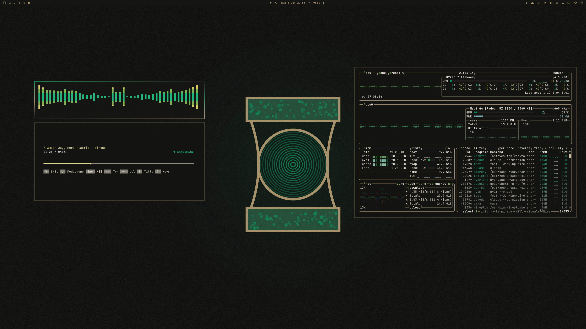

<table>
  <tr>
    <td>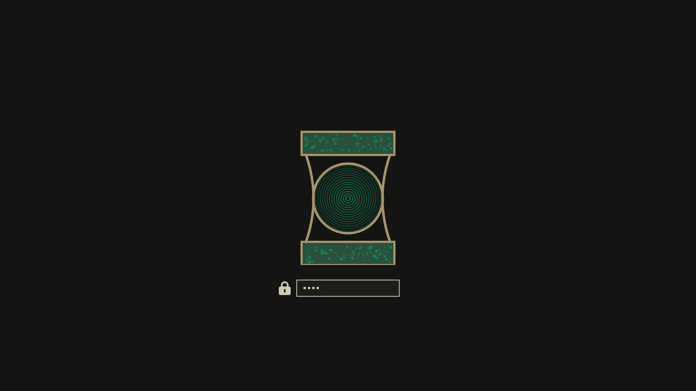</td>
  </tr>
</table>

## Install

```bash
omarchy theme install https://github.com/Devis99/omarchy-lanterns-theme
```

## What's Included

- Core Omarchy colours, a Glint window border (emerald into brass) and a ring-styled bar, menu and launcher.
- App themes for Discord (Vencord), GTK, btop, cava and cliamp, plus Yaru-olive icons.
- A ring-face Plymouth unlock logo and a 15-wallpaper set in `backgrounds/`.
- The palette as a Base24 scheme in `lanterns-base24.yaml`.

## Palette

Every colour is measured from the wallpapers and the show's stills: emerald from the ring's glow, brass from its frame, olive green from the lantern's glass, yellow from the title-sequence lens, steel from the lantern's metal, and the error colour from the one warm light in the set, a motel neon sign. Each colour sits at its own peak saturation in the footage, so nothing is lifted beyond what the show itself shows.

It is a dark theme without being another jade theme: the ground is near-neutral graphite, green is reserved for the ring, and the warm tones come from metal and neon instead of red.

## Wallpapers

All wallpapers are 3840x2160. The stills are from HBO's *Lanterns*; the series, its characters and the Green Lantern emblem belong to DC and Warner Bros. Discovery. They're here for personal desktop theming in an unofficial fan theme. Episode and timestamp for each are in `backgrounds/SOURCES.md`.

<table>
  <tr>
    <td>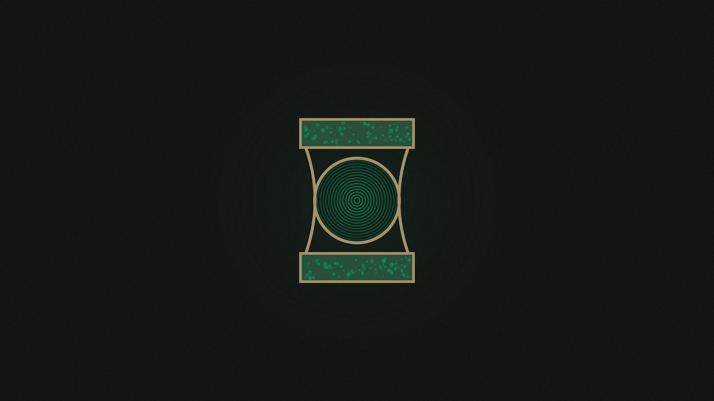<br><sub>01 Ring Face</sub></td>
    <td>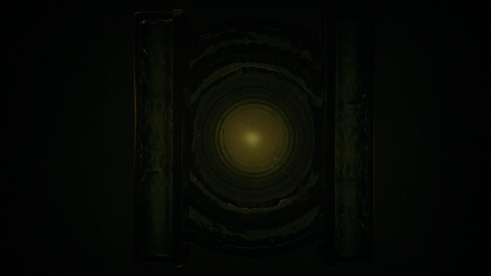<br><sub>02 Title Lens</sub></td>
    <td>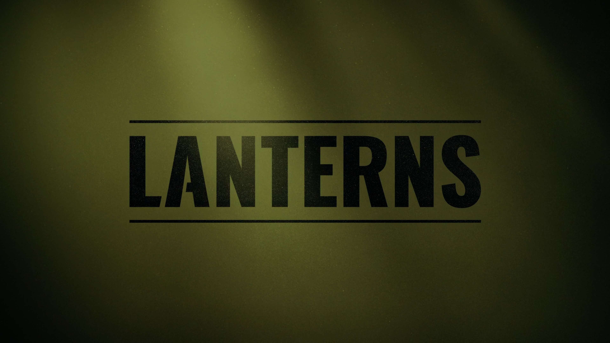<br><sub>03 Title Lanterns</sub></td>
  </tr>
  <tr>
    <td>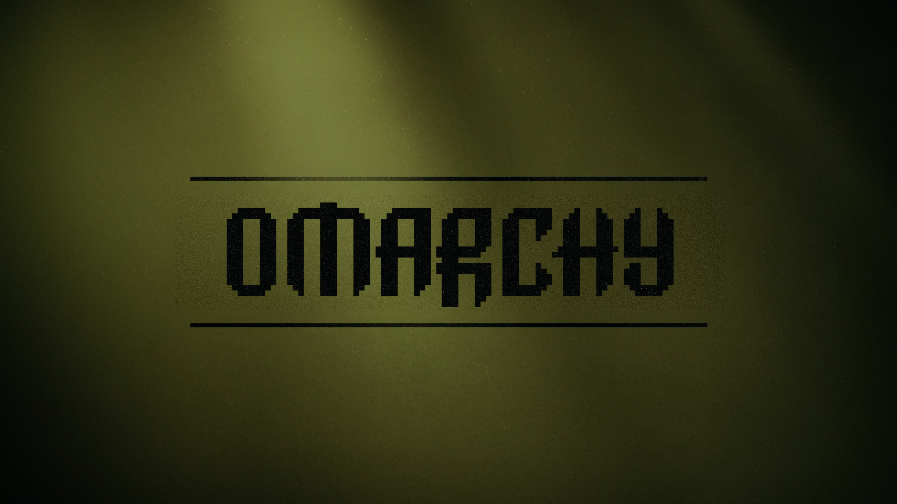<br><sub>04 Title Omarchy</sub></td>
    <td>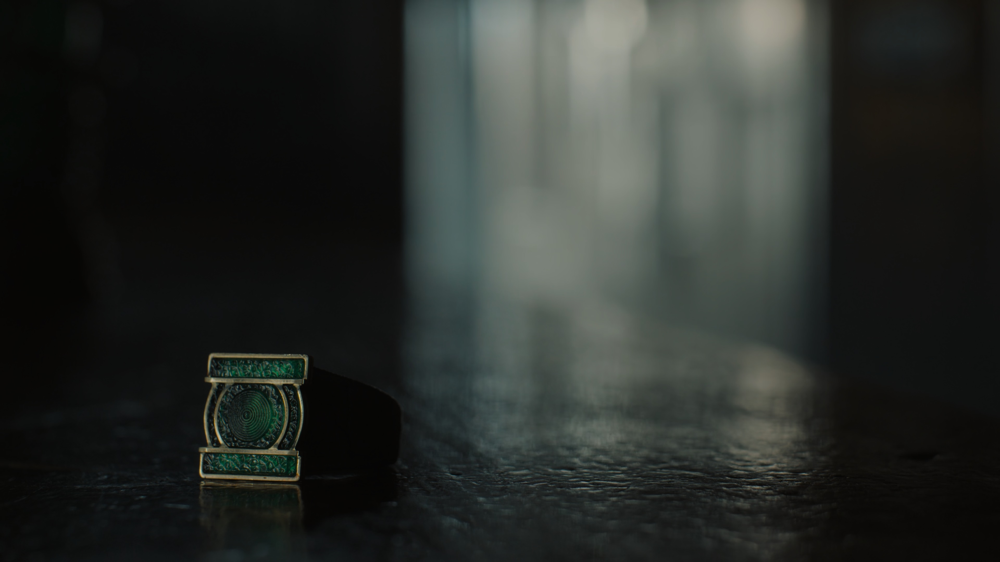<br><sub>05 Hal Ring</sub></td>
    <td>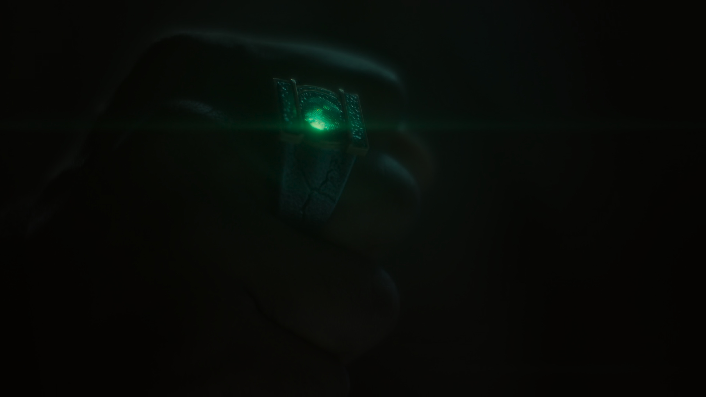<br><sub>06 Hal Fist</sub></td>
  </tr>
  <tr>
    <td>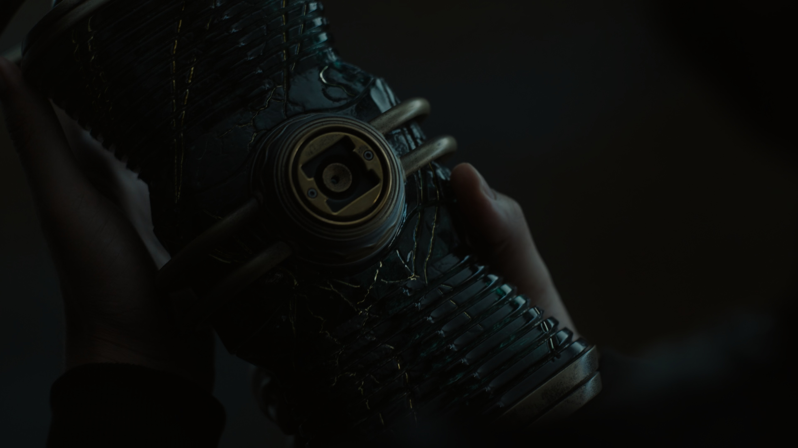<br><sub>07 John Lantern</sub></td>
    <td><br><sub>08 John Lantern Contours</sub></td>
    <td>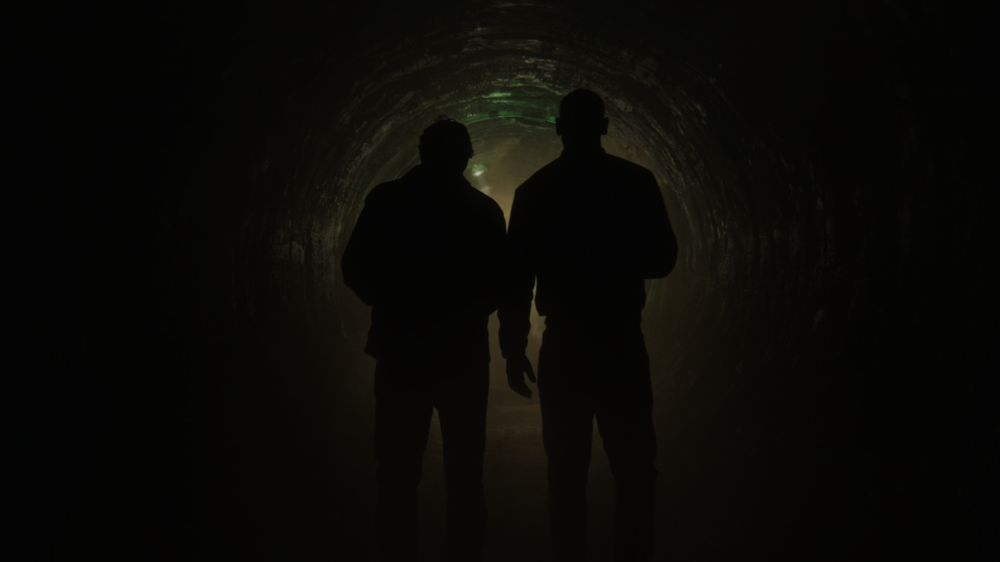<br><sub>09 Tunnel</sub></td>
  </tr>
  <tr>
    <td>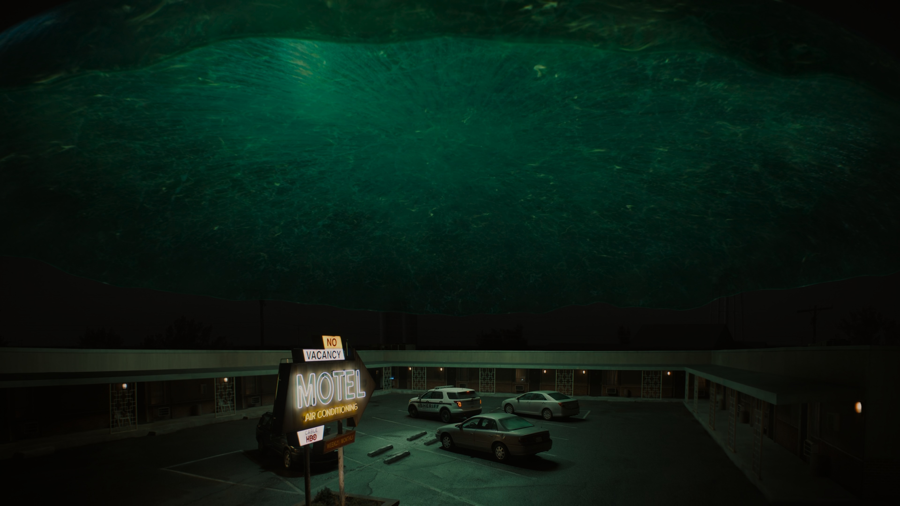<br><sub>10 Motel Night</sub></td>
    <td>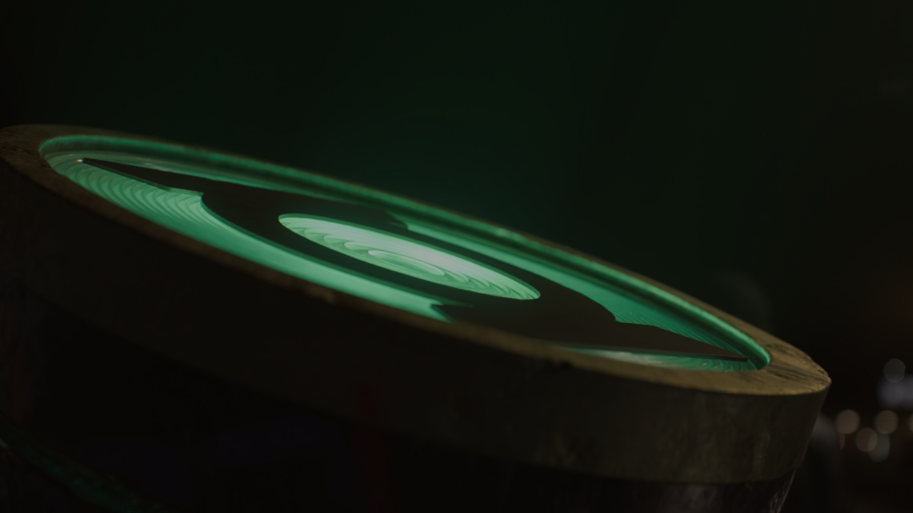<br><sub>11 Beacon</sub></td>
    <td><br><sub>12 John Lantern Face</sub></td>
  </tr>
  <tr>
    <td>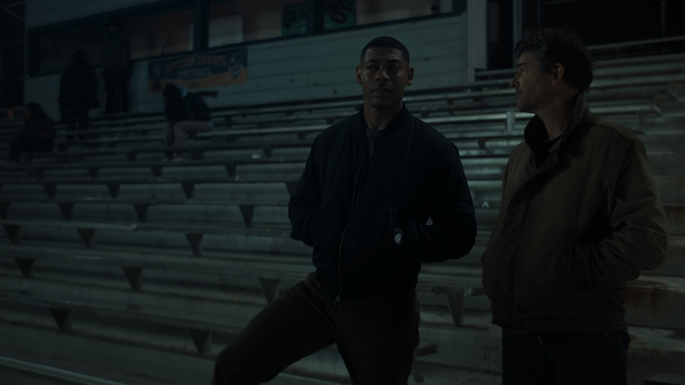<br><sub>13 Hal John Bleachers</sub></td>
    <td><br><sub>14 Hal John Motel</sub></td>
    <td><br><sub>15 Hal John Park</sub></td>
  </tr>
</table>
